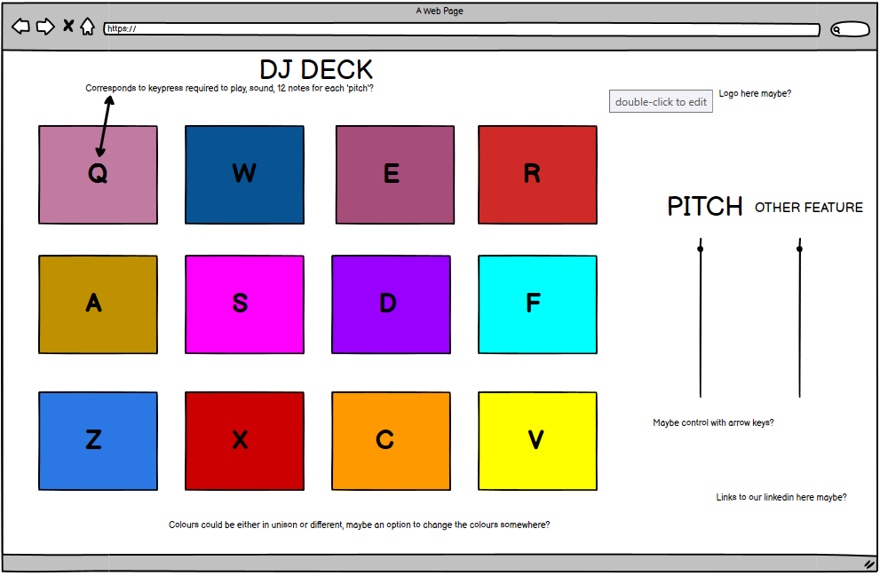

# DJ IN DA HOUSE 

### responsive picture 

### Game Idea 

Our game is a memory-based 'Simon Says' game in which a sequence of button inputs is shown to the player; afterwords the player must repeat the same sequence by 
pressing the buttons in the correct order in order to progress to the next round and earn a point on the score counter. Each round of the game increases the number of button inputs in the sequence, meaning the player must remember a larger number of inputs each time. 

If the player fails to input the sequence correctly then they will fail the game and must restart if they want to continue to play. The sequence of buttons will reset itself so
the player will have to work their way up again. 

### User Stories 

### logos 

### Wireframes

### References 

- [mp3cut](https://mp3cut.net/): Used to snip audio clips. 

- [Epide Mic Sounds](https://www.epidemicsound.com/music/genres/): Used to source all audio for the project/ game. Allows public performance rights etc.

### Credit 

- Brendon Moeller: Backing track for the game [Find Here](https://www.epidemicsound.com/track/xfBuBNCESe/).